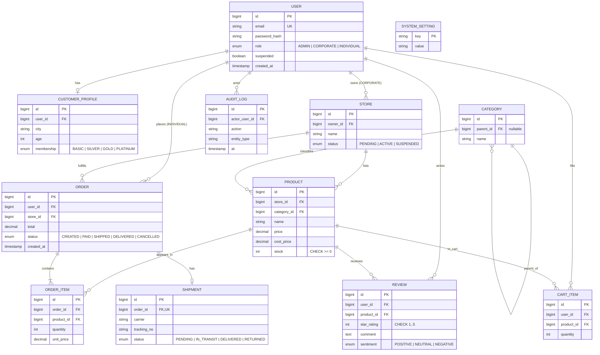

# Entity-Relationship Diagram

The diagram below is the canonical ER model used by the Spring Boot backend (JPA entities under `backend/src/main/java/com/demo/ecommerce/entity/`).

## Normalization Notes

- All entities are in **3NF**: no transitive dependencies; non-key attributes depend on the whole primary key.
- `OrderItem` is a proper junction with its own PK plus quantity/unit_price (avoids storing computed total on `Order` denormalized).
- `Category` is recursive (self-referencing `parent_id`) for category hierarchy.
- Lookup enums (`OrderStatus`, `ShipmentStatus`, `MembershipType`, `Sentiment`, `StoreStatus`, `RoleType`) are stored as `VARCHAR` via `@Enumerated(EnumType.STRING)` for readability and migration safety.

## Indexes (selected)

| Table | Index | Purpose |
|---|---|---|
| `product` | `idx_product_store(store_id)` | dashboard product-by-store queries |
| `product` | `idx_product_category(category_id)` | category drill-down |
| `order` | `idx_order_user(user_id)` | individual dashboard |
| `order` | `idx_order_store(store_id)` | corporate dashboard |
| `order` | `idx_order_status(status)` | admin pipeline view |
| `review` | `idx_review_product(product_id)` | product page aggregation |
