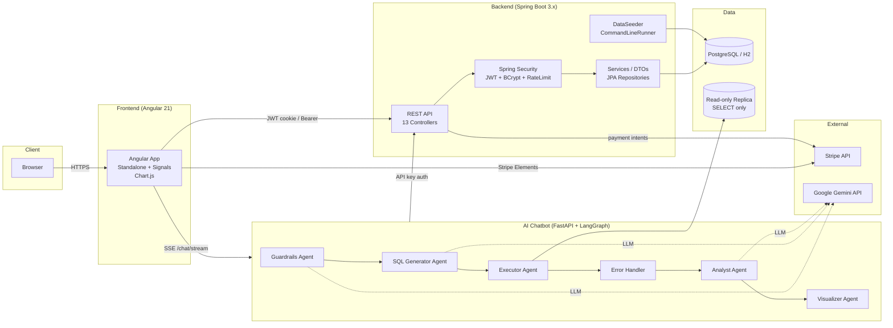
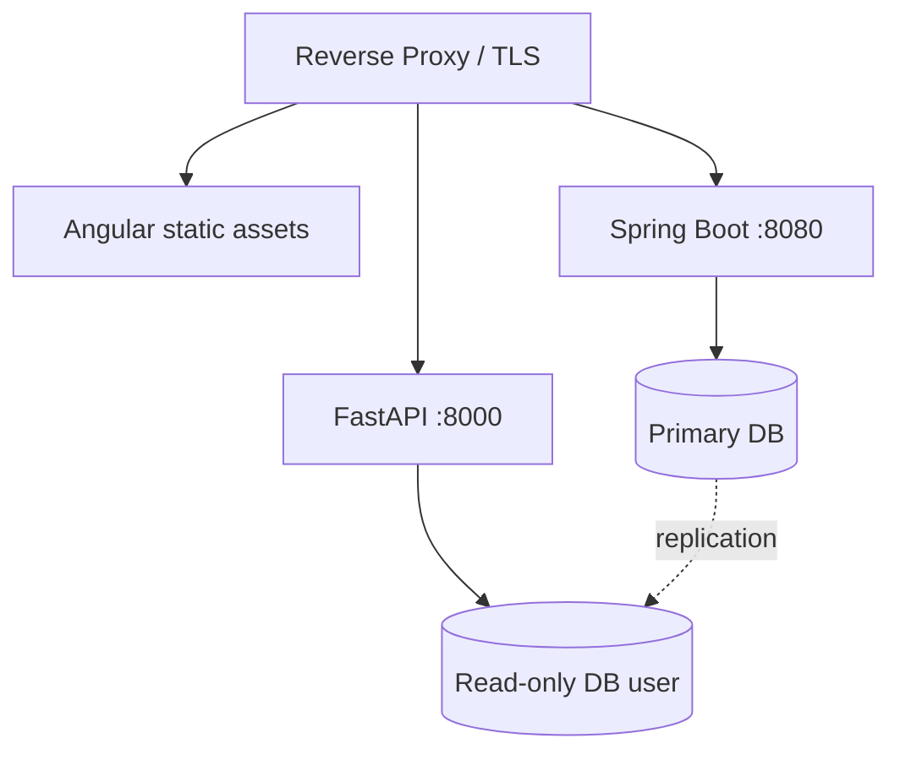

# System Architecture

## Request Flow Examples

### 1. Login (Individual user)
1. `POST /api/auth/login` → `AuthController` validates DTO.
2. `AuthService` looks up user, `BCryptPasswordEncoder.matches()` checks password.
3. `JwtUtil.generate()` issues HS512 token with `{userId, email, role}` claims.
4. Token returned as **HttpOnly + Secure + SameSite=Strict** cookie + JSON body.
5. Subsequent requests pass through `JwtFilter` → `RateLimitFilter` → controller.

### 2. Dashboard data (Corporate user)
1. `GET /api/dashboard/corporate/sales` with JWT.
2. `SecurityConfig` enforces `hasAuthority("CORPORATE")`.
3. `DashboardService` joins `Order × OrderItem × Product` filtered by `store.owner_id = user.id`.
4. Response wrapped in DTO; Angular renders Chart.js bar/donut.

### 3. Chatbot question ("show me my orders this month")
1. Angular sends `POST /chat/stream` (SSE) with API key header + role + userId.
2. **Guardrails** classifies intent (greeting / scope / injection); falls back to keyword regex if Gemini down.
3. **SQL Generator** matches one of ~23 deterministic templates → injects role-scoped WHERE clause (`user_id = ?` for INDIVIDUAL, `store_id IN (?)` for CORPORATE).
4. **Executor** runs `SELECT`-only against read-only replica with `ALARM` timeout.
5. **Analyst** asks Gemini to explain results in natural language.
6. **Visualizer** generates Plotly code; AST validator blocks `import`, `__builtins__`, `eval`.
7. Stream emits per-step SSE events; Angular renders pipeline + chart/table/SQL tabs.

## Security Layers

| Layer | Mechanism |
|---|---|
| Transport | HTTPS, HSTS-ready CORS config |
| Authentication | JWT HS512 (1h access, 7d refresh), HttpOnly cookies |
| Authorization | Role-based (`ADMIN`/`CORPORATE`/`INDIVIDUAL`) at endpoint + service layer |
| Input | `@Valid` DTOs, `InputValidator` regex, parameterized JPA queries |
| Rate limit | `RateLimitFilter` (per-IP + per-user) |
| Chatbot | API key header, SELECT-only DB user, AST sandbox for generated code |
| Secrets | Env vars (`JWT_SECRET`, `STRIPE_SECRET_KEY`, `AI_API_KEY`, `CHATBOT_API_KEY`) |

## Deployment Topology (logical)

